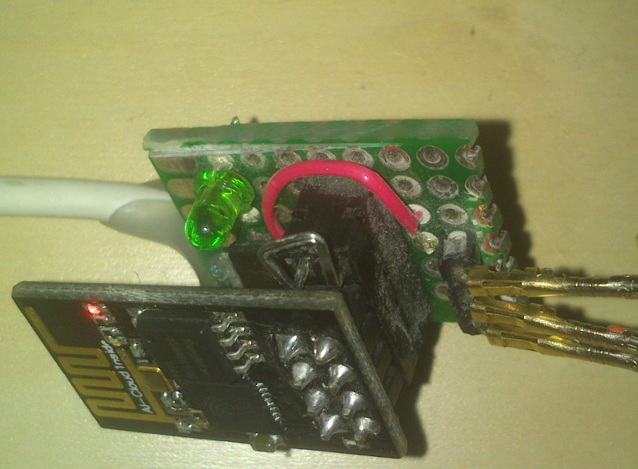
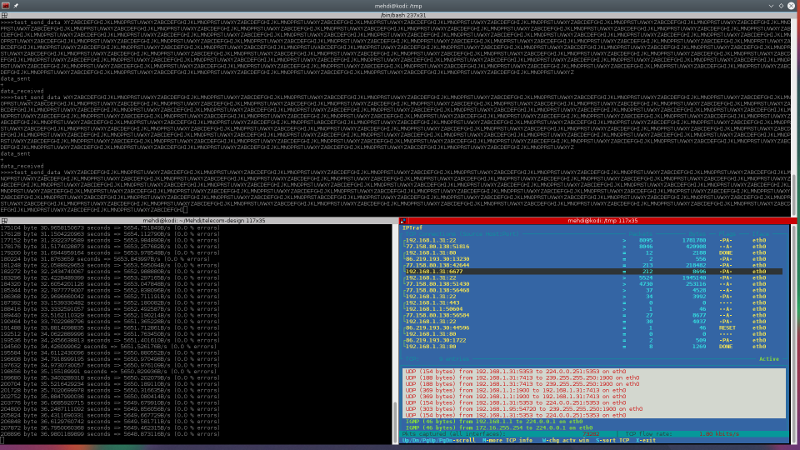
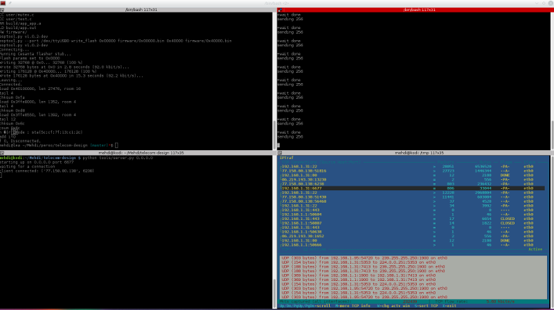

#Challenge esp8266
## Setup
 - Test depuis une connexion extérieure vers un raspberry pi 2 via une connexion personelle
 - un nom de domaine
 - esp8266-01 
 - sdk 1.2
 - ftdi

## Test
Vitesse maximale d'upload d'un pattern fixe ``ABCDEFGHIJKLMNOPRSTUVWXYZ``

### Setup
 - Décommenter dans user/user_config.h
   ``//#define TEST "ABCDEFGHIJKLMNOPRSTUVWXYZ"``
 - Sur le serveur, lancer ``python tools/server.py 0.0.0.0 test``
 - Brancher l'esp8266
### Principe
 - la boucle principale remplie la fifo avec les données
 - les données sont envoyées via TCP
 - le serveur check si chaque octet reçu est bien celui qui devait l'être
 - le serveur renvoie en réponse un signal pour indiquer si il y a eu une erreur de transmission

```
data = connection.recv(9999)
        for c in data:
          needed = TEST[index%(len(TEST))]
          if c != needed:
            err = True
          index += 1
```

### Résultats


Après 5 minutes de test, on obtient:

 - un taux d'erreur à la réception d'environ 1.29702359027e-06%
 - iptraf annonce environ 2.20 kbits/s sur le port concerné

## Zip
### Setup
 - Commenter dans user/user_config.h
   ``#define TEST "ABCDEFGHIJKLMNOPRSTUVWXYZ"``
 - Sur le server, lancer ``python tools/server.py 0.0.0.0``
 - Brancher l'esp8266
 - Attendre le message "client connected"
 - lancer ``python tools/serial_send.py /dev/ttyUSB0 /path/to/zip``
 - Attendre l'upload, et récupérer /tmp/out.bin sur le serveur

### Principe
- serial_send.py envoie un buffer de MAX_SIZE/2 sur l'uart de l'esp8266
- On rempli la fifo d'octets de taille MAX_SIZE à envoyer par ce que l'on reçoit sur la liaison série.
- Dans la tache principale, le contenu de la fifo est envoyé en TCP
- Le callback ``data_sent`` envoie sur la liaison serie un signal pour informer serial_send.py qu'il peut à nouveau envoyer des données

```
void ICACHE_FLASH_ATTR process_uart() {
  
  uint8 uart_buf[128]={0};
  uint16 len = 0;
  len = rx_buff_deq(uart_buf, 128 );
  if(len !=0)
  {
    int i;
    for(i=0; i < len; i++) {
      if(! fifo_isfull(&m_fifo))
      {
        fifo_push(&m_fifo, uart_buf[i]);
      }
      if( fifo_freespace(&m_fifo) < MAX_BUFFER_SIZE / 4)
      {
        os_printf("-\n");
      }
    }
  }
}
```

### Résultats



 - iptraf annonce un débit de 5.60kbits/s
 - la taille du fichier reçu est égal à la taille du ficher envoyé
 - le md5 est différent (très probablement lié au taux d'erreur non nul vu en mode test)

## Conclusion

Afin d'améliorer les résultats, il faudrait:

- refaire les tests sur un serveur local, sans passer par internet
- Améliorer le protocole TCP ( retransmettre en cas d'erreur, rajouter de la correction d'erreur, crc...)
- Améliorer le protocole série ( plus d'échange sur la quantité de donnée à envoyer, afin de remplir au maximum la fifo)

## Approfondissement
### Mise en place du contrôle de flux hardware ( RTS / CTS )

La mise en place du contrôle hardware de flux permettrait d'enlever le "protocole" de transfert au niveau logiciel.

Supporté par le processeur, mais pins non exportées sur l'esp8266-01 ( [esp8266_gpio_pin_allocations](http://www.esp8266.com/wiki/doku.php?id=esp8266_gpio_pin_allocations) )

### Serial protocol
- Instrumentation de ```serial_send.py```: 97% du temps effectif correspond à l'attente du retour de l'esp8266 (acquittement "+")
- Désactivation de cette attente, le débit augmente mais le fichier à l'arrivée n'est pas complet: fifo overrun

#### Amélioration
- mise en place d'un double-buffer
- Utilisation d'un protocole (zmodem?)